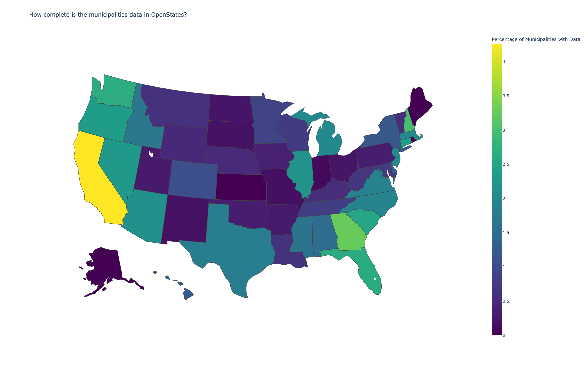

## OpenStates Municipalities Data Analysis

This repository is a fork from [OpenStates](https://github.com/openstates/people) and contains a Python script that analyzes the availability of municipal data in OpenStates compared to the total number of municipalities in the United States. The analysis is based on data from the U.S. Census and OpenStates. The purpose of this analysis is help focus efforts on states with the most missing data.

By running the script, you will obtain a choropleth map that visualizes the percentage of municipalities with data available in OpenStates for each state.

The script performs the following tasks:
- parses a dataset of total municipalities in the USA from the U.S. Census,
- counts the number of municipalities per state,
- reads the OpenStates data for municipalities from YAML files,
- counts the number of municipalities per state with data available in OpenStates,
- merges the two datasets to calculate the percentage of municipalities with data,
- and generates a choropleth map to visualize the percentage of municipalities with data in OpenStates.

### Requirements
- Python 3.x
- pandas
- plotly
- pyyaml

